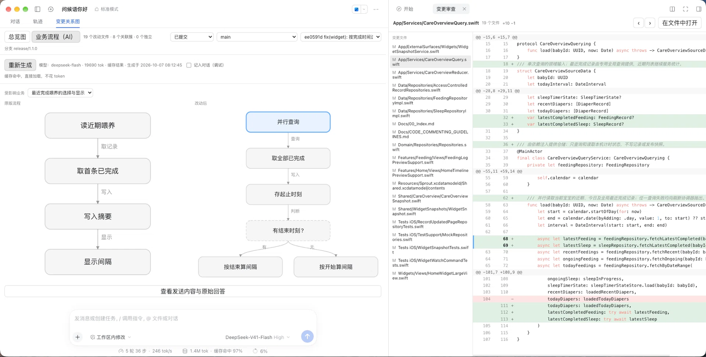

# dsh-review-graph

[中文](README.md) · English · [](https://www.npmjs.com/package/dsh-review-graph)

**Which files call which, how far a change reaches, and where every edit actually is** — read it inside
the conversation instead of opening files one by one.



Three surfaces, in the conversation's middle column:

| What you want to know | What you get |
|---|---|
| Reach: who calls whom | **Relationship graph**: only the files this change touches, in lanes by call depth, with thin lines for the calls |
| Place: where it changed | Click any file → the **review pane** opens the whole change set at that file |
| Content: what changed | Red/green diff, **dual line numbers** (original and changed), **syntax highlighting** (297 languages), a left marker on the line you jumped to |
| Intent: which behaviour it belongs to | **Business flows (AI)**: on request, a **flow diagram** of the original and the changed side, each step anchored to a file and a line |

## Install

Requirements: DSH (Host and Web), and the workspace you review is a **git repository**.

```bash
# 1) from npm (recommended)
dsh plugin --profile <profile> add dsh-review-graph

# 2) from git (no account needed)
dsh plugin --profile <profile> add https://github.com/huaxiaolong/dsh-review-graph

# 3) from the release tarball (no npm account needed; pins a version)
dsh plugin --profile <profile> add https://github.com/huaxiaolong/dsh-review-graph/releases/latest/download/dsh-review-graph-1.0.0.tgz
```

Or in the GUI: **Plugins** in the sidebar → **Add plugin** → paste any of the above (package name, git
address, tarball URL, or a local path).

All three install the same code with the same capabilities; npm is one channel, not a requirement.

Restart DSH afterwards (the Host half is regenerated) and reload the page (the client half), then switch
the middle column to “Relationship graph”.

## Using it

### Relationship graph

* **One file, one box.** A column is one call depth; the leftmost column holds the entries — the files
  nothing else in this change calls.
* **Colours:** blue means the file has references to or from other changed files; yellow means it has
  none in this change (hover a box and it says so).
* **A single click on a file** opens the whole change set in the right column at that file. Lines run
  from caller to callee.
* Top right: **⌃ hides the toolbar** (giving its height to the picture) and **Fit** frames everything
  again. Bottom right: `-`, `+` and a percentage for zoom.
* When relationships are dense, only the strongest 600 are drawn with the count of what was left out
  shown in the corner, plus a **Draw all references** button.

### Review pane (right column)

* The top switches the **change source**: uncommitted, unstaged, staged, a single commit, or a
  comparison against a branch.
* The left rail lists every file in that source; `‹ ›` steps to the previous or next one. **The line you
  jumped to carries a left marker** that does not cover the red/green fills.
* **Open in file** hands the whole file to DSH’s own preview, which has editor-grade highlighting.

### Business flows (AI) — nothing is generated until you ask

* **Generation starts on the button**, and it calls **the model you selected in the conversation**. Before
  it runs, the card states exactly what would be sent: how many files, how large the excerpts are,
  whether the conversation digest is included, and the output limit.
* The result is a **flow diagram with the original and the changed side by side**; clicking a step jumps
  to its file and line.
* **Three cache layers**: re-opening the same material loads the previous answer without spending a
  token; when the material has moved on, the previous answer is **kept and labelled out of date**, and
  regenerating is your call.
* **View what was sent and the raw answer** shows the actual prompt and the model’s reply, for debugging.

## What costs money, and what leaves your machine

* **Only pressing Generate spends tokens.** The graph, the review pane, the diff and the highlighting are
  all local and never touch the network.
* A generation sends the **change excerpts, the file and symbol structure, and (optionally) a
  conversation digest** to the model you chose. **Excerpts are never truncated** — the whole diff goes in.
  A change set larger than the model’s context window fails with a clear error rather than silently
  handing you an answer with pieces missing.
* **The model is chosen in the conversation**, not here: this plugin offers no second model switch. It
  exposes a reasoning-effort control only when your provider actually publishes the options.
* Cached answers live in `<DSH_HOME>/storages/review-graph-flows/`, at most 30 of them, mode `0600`.
  Delete that directory to clear them.

## Limitations

* The graph covers files whose references can be **parsed statically** (JS/TS, Python, Go, Rust, Java and
  others). Files that cannot be parsed appear as isolated (yellow) boxes.
* **Deleted files are absent** from the graph: they are no longer in the workspace index.
* With several entries, the busiest one is placed first and the others sit in the adjacent column.
* A workspace that is not a git repository says so plainly instead of showing an empty pane.

## When something goes wrong

| Symptom | Cause and what to do |
|---|---|
| The pane shows `review graph: xxx is not defined` | A plugin defect; that sentence is the cause. Paste it into an issue. (An error boundary produces it — previously this was a blank tab.) |
| Generation fails saying the output budget was spent on reasoning | The model used its whole budget thinking. Switch to a model that does not think out loud in the conversation, then generate again. |
| It says there is no cache right after you generated | Switching commit or branch clears the pane and re-checks; a changed conversation digest counts as out of date. |
| The graph shows a single file | Only one file changed, or the others have no statically parsable references. |

## Uninstall

```bash
dsh plugin --profile <profile> remove review-graph
rm -rf "$DSH_HOME/storages/review-graph-flows"   # optional: the generated cache
```

## Development, architecture and self-checks

See [docs/DEVELOPMENT.md](docs/DEVELOPMENT.md) (injection contract, layered design, the defect list, and
how to run the 358 self-checks).

## License

MIT © 2026 huaxiaolong. The inlined Prism.js is MIT as well; attribution and the way it is regenerated are
in [vendor/prism/NOTICE.md](vendor/prism/NOTICE.md).
